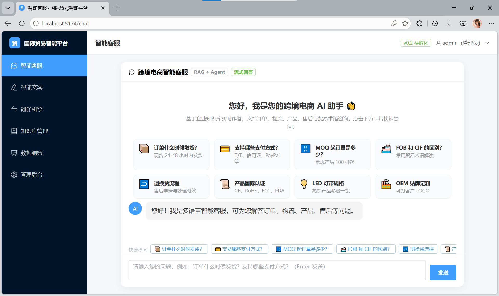
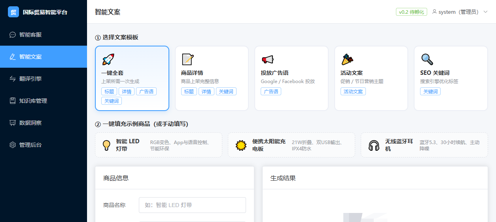
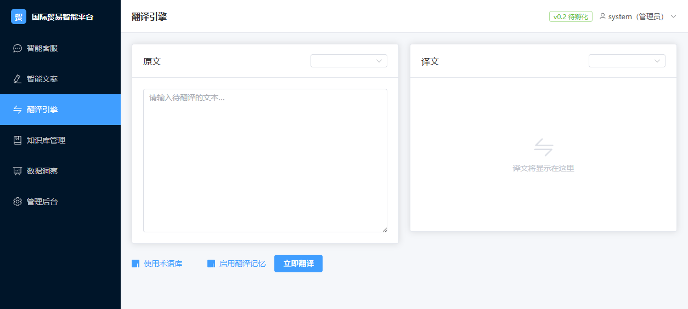

# 国际贸易智能服务平台（跨境电商 AI 运营平台）

基于 **大模型 + RAG + Agent** 打造的一站式外贸智能运营平台，帮助外贸企业「单人驾驭多语言交流」，显著降低对外贸业务员岗位的依赖。

> 📌 完整项目文档（背景 / 架构 / 进度 / 踩坑 / 数据口径）见 [`docs/项目文档.md`](docs/项目文档.md)

---

## 界面预览

| 智能客服（RAG + Agent） | 智能文案 | 翻译引擎 |
|:---:|:---:|:---:|
|  |  |  |

---

## 产品线全景

平台由 **六条产品线 + 一个工程底座** 组成，各产品线共享同一套可插拔 AI 基础设施：

| 产品线 | 核心能力 | 亮点 |
|--------|----------|------|
| 🤖 **智能客服** | 基于企业知识库的 RAG 问答，支持多轮对话、订单/物流/售后意图识别、高风险自动转人工 | **SSE 流式打字机**（思考过程 + 正文分事件推送）、回答**可溯源**（来源文件 + 相似度 + 片段摘要） |
| 🌐 **多语言翻译** | 30+ 语种实时翻译（语言码透传 LLM），外贸术语强约束译法 | **持久化术语库**（FOB/CIF/L/C 注入 Prompt）+ **两级翻译记忆**（进程内 LRU 1 万条 + SQLite，跨重启命中） |
| ✍️ **智能文案** | 商品标题 / 详情描述 / 广告语 / SEO 标签一键生成，多语言输出 | **asyncio 多段并发生成**，延迟从四段串行之和降为最慢单段；支持批量商品 |
| 📚 **知识资产** | 企业知识库上传 → 解析（PDF/Word/MD/TXT/CSV）→ 清洗（含 PII 脱敏）→ 语义分块 → 向量化 | 多租户隔离（tenant_id 全链路 + 检索层过滤防跨租户泄漏）、同名替换与按 doc_id 精确删除 |
| 📊 **数据洞察** | 运营看板：会话量 / 平均延迟 / 满意度 / 意图分布 / Token 成本 / 近 7 日趋势 | 按租户隔离统计，高频问题 Top N |
| 🔌 **平台对接** | 亚马逊 SP-API：OAuth 授权、订单 / 商品目录 / FBA 库存 / 报表，覆盖 10 大站点（US/UK/DE/JP 等） | **AI 联动闭环**：订单智能分析、热销商品自动生成文案、客服订单上下文、商品描述批量翻译（代码已落地，配置凭证后联调） |

### 工程底座（全产品线共享）

- **四大可插拔抽象层**（工厂模式 + Mock 降级）：LLM / Embedding / 向量库 / Agent——无 API Key 全流程可跑通，换供应商只改 `.env` 三行
- **LLM 多端点故障转移**：备用端点链，主端点连接失败 / 超时 / 429 / 5xx / 401·403 密钥失效时自动切换（流式首片段前生效）；当前主通道腾讯 TokenHub `deepseek-v4-flash`，备用 `hy-mt2-pro`
- **混合检索**：向量 + BM25 双路召回 + RRF 融合（k=60）+ 可插拔重排序；BM25 索引与向量矩阵双层缓存，检索毫秒级
- **安全**：PBKDF2 + HS256 JWT 零第三方依赖、注册防提权 + 管理员授权、CORS 白名单自适应、PII 脱敏、审计日志
- **工程化**：Alembic 数据库迁移、Docker Compose（生产多 worker / 健康检查）、跨平台一键启动器、25 项自动化测试

---

## 架构

```
用户交互层   Vue3 Web 端 | REST API | 微信/WhatsApp（预留）
服务编排层   意图识别 | 上下文管理 | Agent 工作流 | SSE 流式
RAG 检索层   混合检索(向量+BM25) | RRF 融合(K=60) | 重排序 | 知识溯源
数据模型层   向量库 | 知识库 | LLM(多端点故障转移) | 术语库/翻译记忆
平台对接层   亚马逊 SP-API（订单/目录/库存/报表）→ AI 联动
```

---

## 快速开始

环境要求：Python ≥ 3.11、Node.js ≥ 18

```bash
python launcher.py start      # 一键启动（依赖未变化时秒级启动，自动打开浏览器）
python launcher.py stop       # 一键停止
python launcher.py status     # 服务状态自检
```

| 服务 | 地址 |
|------|------|
| 前端页面 | http://localhost:5174 |
| 后端 API | http://localhost:8009 |
| 接口文档（Swagger） | http://localhost:8009/docs |

- 默认管理员 `admin / admin123`（生产务必修改）
- 不配置 `LLM_API_KEY` 自动降级 Mock，全流程可跑通；接入真实模型改 `backend/.env` 三行即可
- 亚马逊对接需在 `backend/.env` 配置 LWA + AWS IAM 凭证，详见 [`docs/操作手册.md`](docs/操作手册.md) 第四章

---

## 测试与数据口径

```bash
cd backend && pytest tests/
```

- **25 项自动化测试**（单元 14 + 冒烟 8 + 租户隔离 3），实测 23 过 2 挂（2 例依赖真实 LLM Key，账户欠费 402 即挂）
- 检索质量：自建 **52 条评测集**驱动调优，当前 **Recall@3 = 100%、MRR = 0.942**（Mock Embedding 前提，`scripts/eval_rag.py` 可一键复跑；接真实 Embedding 后需重调）

> 所有对外数字均可在代码与评测脚本中复现，详见 [`docs/项目文档.md`](docs/项目文档.md) 第九章数据口径。

---

## 文档导航

| 文档 | 内容 |
|------|------|
| [`docs/项目文档.md`](docs/项目文档.md) | 项目唯一权威文档：背景 / 架构 / 进度 / 踩坑 / 数据口径 |
| [`docs/操作手册.md`](docs/操作手册.md) | 启动 / 鉴权 / 各模块接口示例 / 亚马逊对接配置 |
| [`docs/升级推进/`](docs/升级推进/) | V2.0 多平台对接分期推进计划（P0/P1/P2） |
| [`docs/简历面试/`](docs/简历面试/) | 简历项目经历 / 技术详解与面试问答 |

---

## 目录结构

```
├── backend/                 # FastAPI 后端
│   ├── app/api/v1/          # REST API（六大模块 + 亚马逊 SP-API + 鉴权）
│   ├── app/core/            # LLM / Embedding / 向量库 / 安全 / 亚马逊客户端
│   ├── app/services/        # RAG / 客服 / 文案 / 翻译 / 洞察 / 亚马逊 AI 联动
│   ├── app/db/              # SQLAlchemy 模型（8 张表）+ Alembic 迁移
│   ├── tests/               # 单元 / 冒烟 / 租户隔离测试
│   └── scripts/             # ingest / eval_rag / check_config
├── frontend/                # Vue 3 + Element Plus（六大页面 + 登录）
├── docs/                    # 项目文档 / 操作手册 / 升级推进 / 简历面试
├── launcher.py              # 一键启动器
└── docker-compose*.yml      # 本地 / 生产编排
```

---

## 许可

内部项目脚手架，遵循公司数据安全与合规要求。
